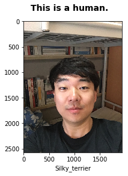
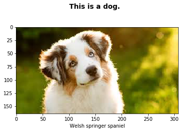
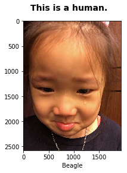
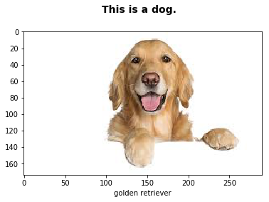

# Project: Dog Breed Classifier

## Goal

Welcome to the Convolutional Neural Networks (CNN) project in the AI Nanodegree! In this project, you will learn how to build a pipeline that can be used within a web or mobile app to process real-world, user-supplied images. Given an image of a dog, your algorithm will identify an estimate of the canine’s breed. If supplied an image of a human, the code will identify the resembling dog breed.


## Result
|           Human Image            |          Dog Image           |
| :------------------------------: | :--------------------------: |
|  |  |
|  |  |

## How I Solved
#### 1. Import Datasets

- Download the [dog dataset](https://s3-us-west-1.amazonaws.com/udacity-aind/dog-project/dogImages.zip).
- Download the [human dataset](https://s3-us-west-1.amazonaws.com/udacity-aind/dog-project/lfw.zip).

#### 2. Detect Humans

- Use OpenCV's implementation of [Haar feature-based cascade classifiers](http://docs.opencv.org/trunk/d7/d8b/tutorial_py_face_detection.html)

#### 3. Create a CNN to Classify Dog Breeds

- Using Transfer Learning
- VGG19 Test accuracy: 48.0861%
  Resnet50 Test accuracy: **81.5789%**
  InceptionV3 Test accuracy: 1.5550%
  Xception Test accuracy: 2.6316%

## Terms
1. Deep Neural Networks
   - Log-loss Error Function
   - Softmax
   - One-Hot Encoding
   - Maimum Likelihood
   - Cross-Entropy
   - Logistic Regression
   - Gradient Descent
   - Feedforward
   - Backpropagation
   - Keras
   - Stochastic Gradient Descent
   - Learning Rate Decay
   - Overfitting and Underfitting
   - Early Stopping
   - Regularization
   - Dropout
   - Vanishing Gradient
   - Local Minima
   - Momentum
2. Convolutional Neural Networks
   - Local Connectivity
   - Stride and Padding
   - Pooling Layers/Max Pooling Layers
   - Image Augmentation
   - Visualizing CNNs
3. Transfer Learning

## Skills
Language: Python
Frameworks/Libraries:  Jupyter Notebook, Numpy, OpenCV, Keras, glob, matplotlib, PIL

## How to run

1. Clone the repository and navigate to the downloaded folder.

```
git clone https://github.com/udacity/dog-project.git
cd dog-project
```

2. Download the [dog dataset](https://s3-us-west-1.amazonaws.com/udacity-aind/dog-project/dogImages.zip). Unzip the folder and place it in the repo, at location `path/to/dog-project/dogImages`.
3. Download the [human dataset](https://s3-us-west-1.amazonaws.com/udacity-aind/dog-project/lfw.zip). Unzip the folder and place it in the repo, at location `path/to/dog-project/lfw`. If you are using a Windows machine, you are encouraged to use [7zip](http://www.7-zip.org/) to extract the folder.
4. Donwload the [VGG-16 bottleneck features](https://s3-us-west-1.amazonaws.com/udacity-aind/dog-project/DogVGG16Data.npz) for the dog dataset. Place it in the repo, at location `path/to/dog-project/bottleneck_features`.
5. Switch [Keras backend](https://keras.io/backend/) to TensorFlow.
   - **Linux** or **Mac**:` KERAS_BACKEND=tensorflow python -c "from keras import backend"`
   - **Windows**:` set KERAS_BACKEND=tensorflow python -c "from keras import backend"`
6. Open the notebook.
```
jupyter notebook dog_app.ipynb
```
