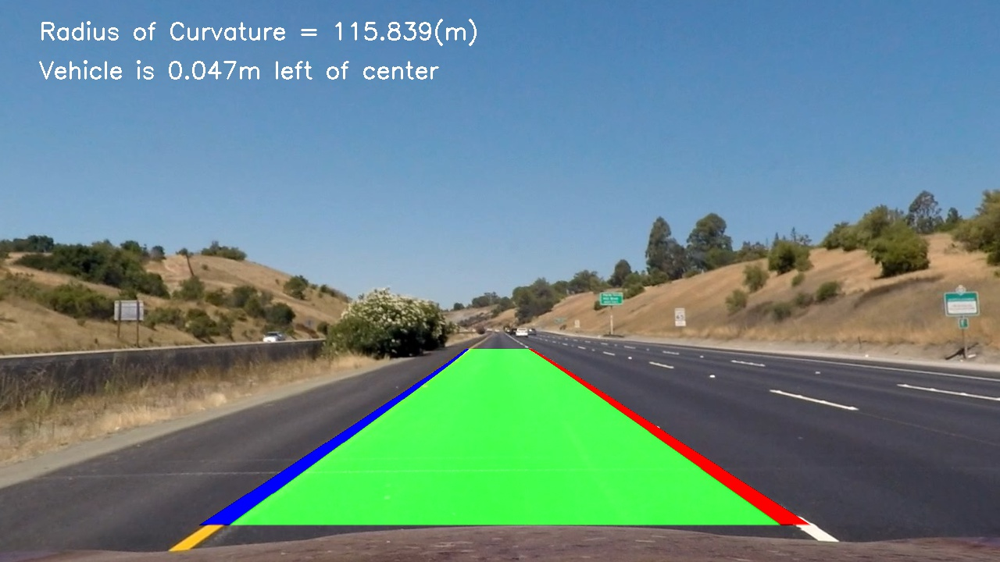
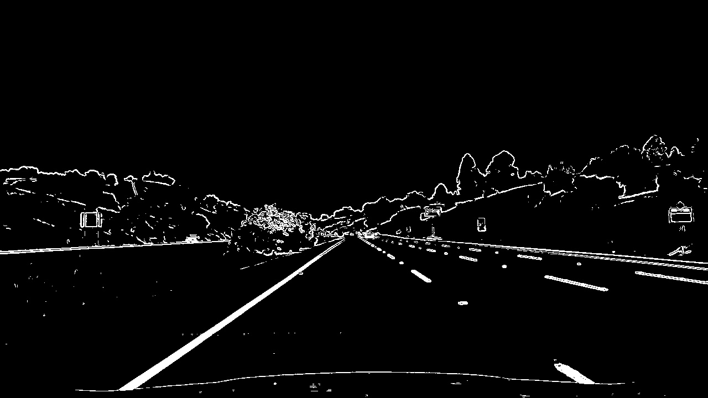
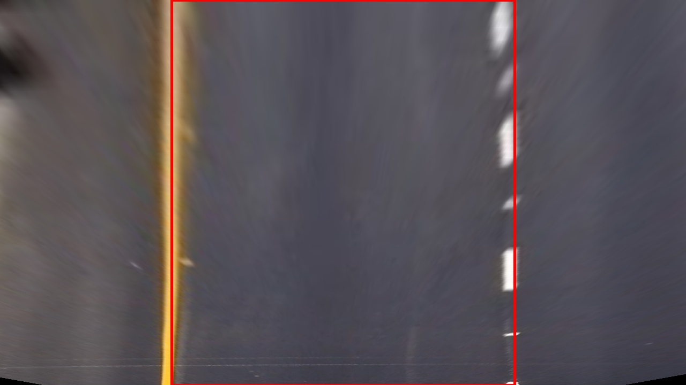
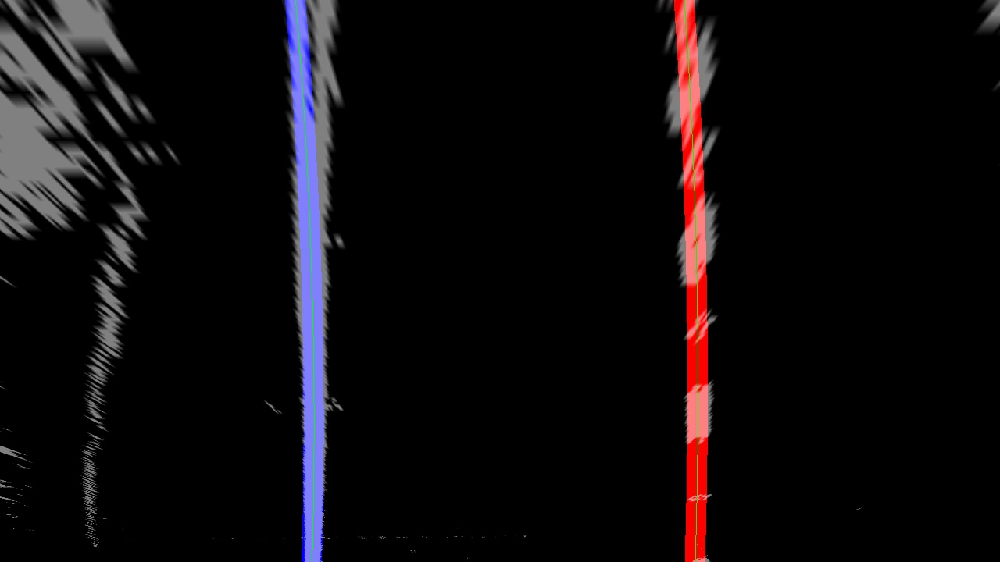

# Project: Advanced Lane Finding

[](http://www.udacity.com/drive)

## Goal

In this project, your goal is to write a software pipeline to identify the lane boundaries in a video from a front-facing camera on a car. The camera calibration images, test road images, and project videos are available in [the project repository](https://github.com/udacity/CarND-Advanced-Lane-Lines).

| Input                           | Output                            |
| ------------------------------- | --------------------------------- |
|  |  |

## Result
[Output Video](https://youtu.be/26nmrx_IyeU)

## How I Solved
#### 1. Camera Calibration & Distortion correction
The code for this step is contained in `camera_calibration.ipynb`.
| Original Image                        | Undistorted Image                        |
| ------------------------------------- | ---------------------------------------- |
|  |  |
#### 2. Color/Gradient threshold
| Undistorted Input Image                  | Combo Image                     |
| ---------------------------------------- | ------------------------------- |
|  |  |
#### 3. Perspective transform & Detect lane lines including sanity check
| Warped Image                      | Color Lines Image                     |
| --------------------------------- | ------------------------------------- |
|  |  |
#### 5. Draw lanes on original images 

#### 6. Calculate the additional information of the road

I did this in lines 195 through 204 in my code `image_gen.py`. ([Reference](http://www.intmath.com/applications-differentiation/8-radius-curvature.php))


## Terms
1. Distortion Correction
2. Calibrating a Carmera
3. Lane Curvature
4. Perspective Transform
5. Color/Gradient Thresholds
6. HLS
7. Sliding Window

## Skills
Language: Python
Frameworks/Libraries:  Jupyter Notebook, Numpy, OpenCV, Matplotlib, Pickle, MoviePy

## How to run

#### Run


1. This lab requires [CarND Term1 Starter Kit](https://github.com/udacity/CarND-Term1-Starter-Kit)

2. Download [repository](https://github.com/OliverPark/CarND-Term1-P4-Advanced-Lane-Lines.git)
   ```Shell
   git clone https://github.com/OliverPark/CarND-Term1-P4-Advanced-Lane-Lines.git
   ```

3. Set your environment and run `camera_calibration.ipynb` file
   ```Shell
   source activate your_env_name
   jupyter notebook
   ```

4. Run
   ```Shell
   python image_gen.py
   ```
   or
   ```Shell
   python video_gen.py
   ```