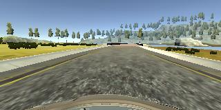
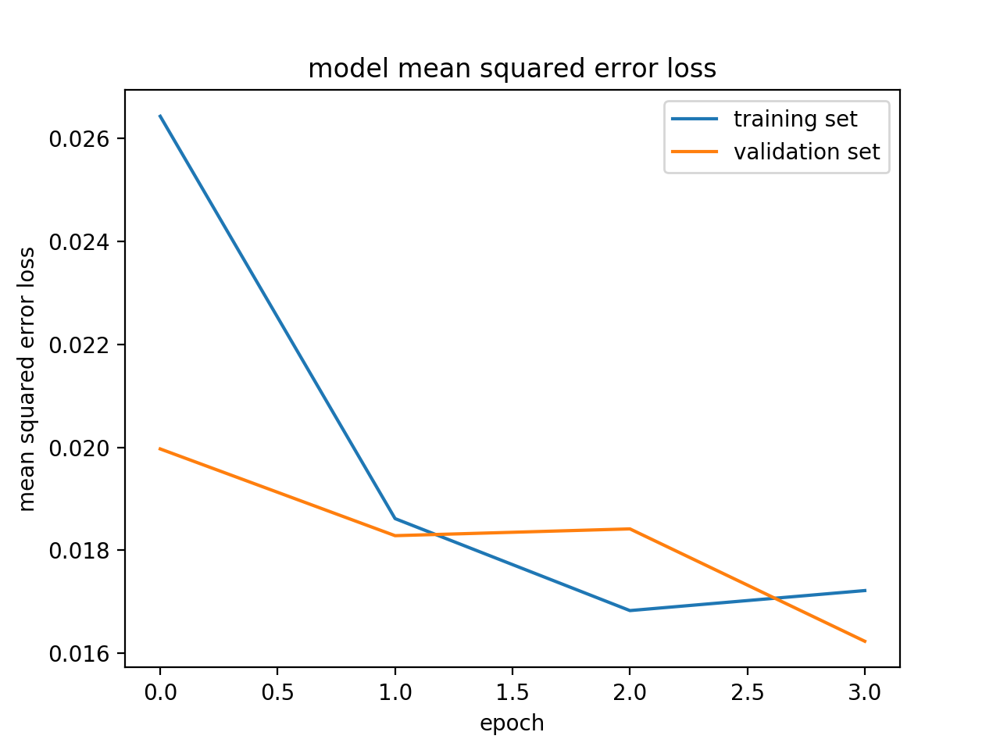

# Project: Behavioral Cloning

[](http://www.udacity.com/drive)

## Goal

In this project, you will use what you've learned about deep neural networks and convolutional neural networks to clone driving behavior. You will train, validate and test a model using Keras. The model will output a steering angle to an autonomous vehicle.

We have provided a simulator where you can steer a car around a track for data collection. You'll use image data and steering angles to train a neural network and then use this model to drive the car autonomously around the track.

| Input               | Output       |
| ------------------- | ------------ |
| driving_log.csv^1)^ | steering^2)^ |

**1) driving_log.csv**

| center                                   | left                                 | right                                 | steering   | throttle  | brake | speed     |
| ---------------------------------------- | ------------------------------------ | ------------------------------------- | ---------- | --------- | ----- | --------- |
| IMG/center_2016_12_01_13_32_42_548.jpg^3)^ | IMG/left_2016_12_01_13_32_42_548.jpg | IMG/right_2016_12_01_13_32_42_548.jpg | 0          | 0         | 0     | 0.5394107 |
| IMG/center_2016_12_01_13_32_42_648.jpg   | IMG/left_2016_12_01_13_32_42_648.jpg | IMG/right_2016_12_01_13_32_42_648.jpg | 0          | 0         | 0     | 0.5340073 |
| IMG/center_2016_12_01_13_32_42_749.jpg   | IMG/left_2016_12_01_13_32_42_749.jpg | IMG/right_2016_12_01_13_32_42_749.jpg | 0          | 0         | 0     | 0.5285226 |
| IMG/center_2016_12_01_13_32_42_851.jpg   | IMG/left_2016_12_01_13_32_42_851.jpg | IMG/right_2016_12_01_13_32_42_851.jpg | 0          | 0         | 0     | 0.5231478 |
| IMG/center_2016_12_01_13_32_42_952.jpg   | IMG/left_2016_12_01_13_32_42_952.jpg | IMG/right_2016_12_01_13_32_42_952.jpg | 0          | 0         | 0     | 0.5179049 |
| IMG/center_2016_12_01_13_32_43_053.jpg   | IMG/left_2016_12_01_13_32_43_053.jpg | IMG/right_2016_12_01_13_32_43_053.jpg | 0          | 0         | 0     | 0.5127146 |
| IMG/center_2016_12_01_13_32_43_154.jpg   | IMG/left_2016_12_01_13_32_43_154.jpg | IMG/right_2016_12_01_13_32_43_154.jpg | 0          | 0         | 0     | 0.5075763 |
| IMG/center_2016_12_01_13_32_43_256.jpg   | IMG/left_2016_12_01_13_32_43_256.jpg | IMG/right_2016_12_01_13_32_43_256.jpg | 0          | 0         | 0     | 0.5024896 |
| IMG/center_2016_12_01_13_32_43_357.jpg   | IMG/left_2016_12_01_13_32_43_357.jpg | IMG/right_2016_12_01_13_32_43_357.jpg | 0          | 0.735778  | 0     | 0.9536688 |
| IMG/center_2016_12_01_13_32_43_457.jpg   | IMG/left_2016_12_01_13_32_43_457.jpg | IMG/right_2016_12_01_13_32_43_457.jpg | 0.0617599  | 0.9855326 | 0     | 2.124567  |
| IMG/center_2016_12_01_13_32_43_558.jpg   | IMG/left_2016_12_01_13_32_43_558.jpg | IMG/right_2016_12_01_13_32_43_558.jpg | 0.05219137 | 0.9855326 | 0     | 3.286475  |
| IMG/center_2016_12_01_13_32_43_659.jpg   | IMG/left_2016_12_01_13_32_43_659.jpg | IMG/right_2016_12_01_13_32_43_659.jpg | 0.05219137 | 0.9855326 | 0     | 4.440864  |
| IMG/center_2016_12_01_13_32_43_761.jpg   | IMG/left_2016_12_01_13_32_43_761.jpg | IMG/right_2016_12_01_13_32_43_761.jpg | 0.3679529  | 0.9855326 | 0     | 5.565724  |
| IMG/center_2016_12_01_13_32_43_862.jpg   | IMG/left_2016_12_01_13_32_43_862.jpg | IMG/right_2016_12_01_13_32_43_862.jpg | 0.5784606  | 0.9855326 | 0     | 6.626935  |
| IMG/center_2016_12_01_13_32_43_963.jpg   | IMG/left_2016_12_01_13_32_43_963.jpg | IMG/right_2016_12_01_13_32_43_963.jpg | 0.5784606  | 0.9855326 | 0     | 7.730138  |
| IMG/center_2016_12_01_13_32_44_064.jpg   | IMG/left_2016_12_01_13_32_44_064.jpg | IMG/right_2016_12_01_13_32_44_064.jpg | 0.1670138  | 0.9855326 | 0     | 8.83677   |

**2) Steering:** 0.08089697

**3) Front Camera Center Image**


## Result
Here is a video of the vehicle when it is driving autonomously: [Output Video](https://youtu.be/7b3STHnT_8g)

## How I Solved
#### 1. Collecting Training Data
Training data was chosen to keep the vehicle driving on the road. I used a combination of center lane driving, recovering from the left and right sides of the road.
- 2-round original direction driving
- 2-round clockwise direction driving
- only corner-driving
- recovery driving(from left/right to center side)

#### 2. Preprocessing
- Crop a part of images which doesn't contain the track
- Normalized in the model using a Keras lambda layer
#### 3. Model Architecture
```
____________________________________________________________________________________________________
Layer (type)                     Output Shape          Param #     Connected to                     
====================================================================================================
cropping2d_1 (Cropping2D)        (None, 70, 320, 3)    0           cropping2d_input_1[0][0]         
____________________________________________________________________________________________________
lambda_1 (Lambda)                (None, 70, 320, 3)    0           cropping2d_1[0][0]               
____________________________________________________________________________________________________
convolution2d_1 (Convolution2D)  (None, 33, 158, 24)   1824        lambda_1[0][0]                   
____________________________________________________________________________________________________
convolution2d_2 (Convolution2D)  (None, 15, 77, 36)    21636       convolution2d_1[0][0]            
____________________________________________________________________________________________________
convolution2d_3 (Convolution2D)  (None, 6, 37, 48)     43248       convolution2d_2[0][0]            
____________________________________________________________________________________________________
convolution2d_4 (Convolution2D)  (None, 4, 35, 64)     27712       convolution2d_3[0][0]            
____________________________________________________________________________________________________
convolution2d_5 (Convolution2D)  (None, 2, 33, 128)    73856       convolution2d_4[0][0]            
____________________________________________________________________________________________________
convolution2d_6 (Convolution2D)  (None, 1, 32, 256)    131328      convolution2d_5[0][0]            
____________________________________________________________________________________________________
flatten_1 (Flatten)              (None, 8192)          0           convolution2d_6[0][0]            
____________________________________________________________________________________________________
dropout_1 (Dropout)              (None, 8192)          0           flatten_1[0][0]                  
____________________________________________________________________________________________________
dense_1 (Dense)                  (None, 500)           4096500     dropout_1[0][0]                  
____________________________________________________________________________________________________
dropout_2 (Dropout)              (None, 500)           0           dense_1[0][0]                    
____________________________________________________________________________________________________
dense_2 (Dense)                  (None, 250)           125250      dropout_2[0][0]                  
____________________________________________________________________________________________________
dense_3 (Dense)                  (None, 50)            12550       dense_2[0][0]                    
____________________________________________________________________________________________________
dense_4 (Dense)                  (None, 1)             51          dense_3[0][0]                    
====================================================================================================
Total params: 4,533,955
Trainable params: 4,533,955
Non-trainable params: 0
____________________________________________________________________________________________________
```
#### 4. Training Strategy
1. Use adam oprimizer, so the learning rate is not tuned manually. 
2. Add more data the vehicle recovering from left and right sides
3. Data augmentation
  - flipped images
  - left and right camera images with corrected angles
4. The ideal number of epochs was three as evidenced by Mean Squared Error Loss graph.
   

## Terms
1. Data Collection
2. Data Visualization
3. Data Preprocessing
4. Data Augmentation
5. Mean Squared Error Loss
6. Dropout
7. Keras
8. Generator

## Skills
Language: Python
Frameworks/Libraries:  Keras, matplotlib, sklearn
Etc: Amazon Web Services

## How to run

#### Amazon Web Services
- Instead of a local GPU, you could use Amazon Web Services to launch an EC2 GPU instance. (This costs money.)
- [Follow the Udacity instructions](https://classroom.udacity.com/nanodegrees/nd013/parts/fbf77062-5703-404e-b60c-95b78b2f3f9e/modules/6df7ae49-c61c-4bb2-a23e-6527e69209ec/lessons/614d4728-0fad-4c9d-a6c3-23227aef8f66/concepts/f6fccba8-0009-4d05-9356-fae428b6efb4) to launch an EC2 GPU instance with the udacity-carnd AMI.
- Complete the Setup instructions.


#### Run

1. This lab requires [CarND Term1 Starter Kit](https://github.com/udacity/CarND-Term1-Starter-Kit)

2. Download [repository](git@github.com:OliverPark/CarND-Term1-P3-Behavior-Cloning.git)
   ```Shell
   git clone git@github.com:OliverPark/CarND-Term1-P3-Behavior-Cloning.git
   ```

3. Simulator Download
   [Linux](https://d17h27t6h515a5.cloudfront.net/topher/2017/February/58ae46bb_linux-sim/linux-sim.zip)
   [macOS](https://d17h27t6h515a5.cloudfront.net/topher/2017/February/58ae4594_mac-sim.app/mac-sim.app.zip)
   [Windows](https://d17h27t6h515a5.cloudfront.net/topher/2017/February/58ae4419_windows-sim/windows-sim.zip)

4. Using the Udacity provided simulator and my drive.py file, the car can be driven autonomously around the track by executing
   ```Shell
   python drive.py model.h5
   ```
