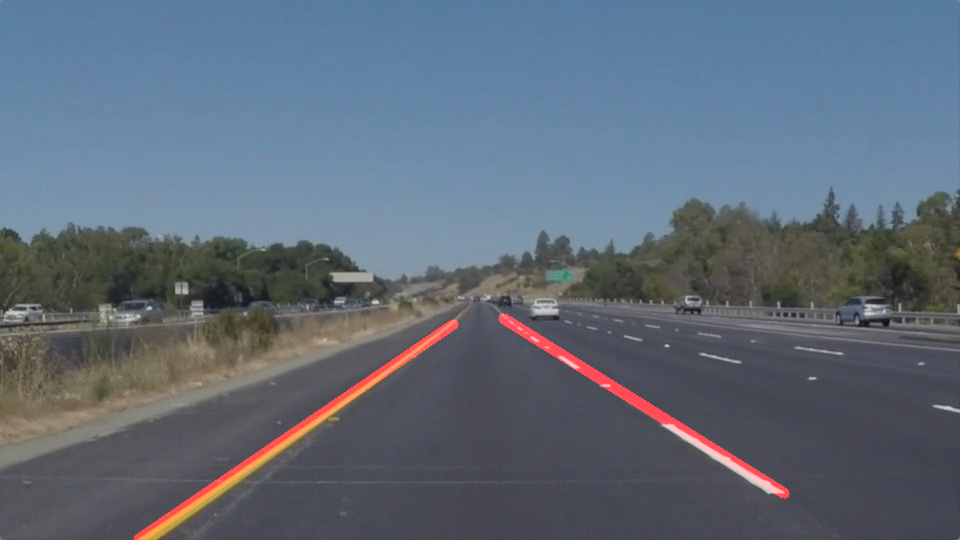

# Project: Finding Lane Lines on the Road

[](http://www.udacity.com/drive)

## Goal

When we drive, we use our eyes to decide where to go. The lines on the road that show us where the lanes are act as our constant reference for where to steer the vehicle. Naturally, one of the first things we would like to do in developing a self-driving car is to automatically detect lane lines using an algorithm.

In this project you will detect lane lines in images using Python and OpenCV. OpenCV means "Open-Source Computer Vision", which is a package that has many useful tools for analyzing images.

| Input Image                     | Output Image                      |
| ------------------------------- | --------------------------------- |
|  |  |

## Result

[Output Video 1](https://youtu.be/GSPfz5wccCo)

[Output Video 2](https://youtu.be/nc-V1JJiVb8)

## How I Solved
1. Read in and grayscale the image
2. Define a kernel size and apply Gaussian smoothing
3. Define our pareters for Canny and apply
4. Run Hough on edge detected image
5. Create a "color" binary image to combine with line image
6. Draw the lines on the edge image
7. Draw the lines on the original image

## Terms

1. Color Selection
2. Region of Interest Selection
3. Grayscaling
4. Gaussian Smoothing
5. Canny Edge Detection
6. Hough Tranform Line Detection

## How to run

### Configuration

You have to configure environment with Anaconda to run this program.

Starter Kit: [Configure and Manage Your Environment with Anaconda](https://github.com/udacity/CarND-Term1-Starter-Kit/blob/master/doc/configure_via_anaconda.md)

### Open and Run

1. Download [repository](https://github.com/OliverPark/CarND-Term1-P1-LaneLines)

   ```Shell
   git clone git@github.com:OliverPark/CarND-Term1-P1-LaneLines.git
   ```

2. Set your environment and run `P1.ipynb` file

   ```Shell
   source activate your_env_name
   jupyter notebook
   ```

3. Run each code in jupyter notebook: `ctrl+enter`

4. Go to **Test on Images**

5. If you run it, it makes images of every steps in a finding lane in `test_images` directoryGaryscale, Gaussian blur, Canny Edge Detection, Marking Region, Hough transform

6. Go to **Test on Videos**

7. Make videos which display lane lines

   - Input files: *solidWhiteRight.mp4*, *solidYellowLeft.mp4*
   - Output files: *white.mp4*, *yellow.mp4*