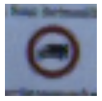

# Project: Traffic Sign Classifier

[](http://www.udacity.com/drive)

## Goal

In this project, you will use what you've learned about deep neural networks and convolutional neural networks to classify traffic signs. You will train and validate a model so it can classify traffic sign images using the German Traffic Sign Dataset. After the model is trained, you will then try out your model on images of German traffic signs that you find on the web.

| Input Images                             | Output           |
| ---------------------------------------- | ---------------- |
| [German Traffic Sign Dataset](http://benchmark.ini.rub.de/?section=gtsrb&subsection=dataset) | [16 35 42 12 24] |

## Result

| **Input Images**                   | **Prediction**                           | **Result** |
| ---------------------------------- | ---------------------------------------- | ---------- |
|  | 16, Vehicles over 3.5 metric tons prohibited | Correct    |
|  | 35, Ahead only                           | Correct    |
|  | 42, End of no passing by vehicles over 3.5 metric tons | Correct    |
|  | 12, Priority road                        | Wrong      |
|  | 24, Road narrows on the right            | Wrong      |


## How I Solved
#### 1. Preprocessing
- Grayscale
  Time: 303.24 -> 196.64(-64.8%) / Validation Accuracy: 0.875 -> 0.910(+4%)
- Normalization
  Time: 303.24 -> 314.3(+3.6%) / Validation Accuracy: 0.875 -> 0.752(-14.1%)
#### 2. Model Architecture
| Layer           | Description                              |
| --------------- | ---------------------------------------- |
| Input           | 32x32x1 Gray image                       |
| Convolution 3x3 | 1x1 stride, same padding, outputs 32x32x16 |
| RELU            |                                          |
| Max pooling     | 2x2 stride, outputs 32x32x16             |
| Convolution 3x3 | 1x1 stride, same padding, outputs 32x32x40 |
| RELU            |                                          |
| Max pooling     | 2x2 stride, outputs 32x32x40             |
| Fully connected | Input: 1000, Output: 333                 |
| Fully connected | Input: 333, Output: 111                  |
| Fully connected | Input: 111, Output: 43                   |
#### 3. Model Training
**Parameters** 
EPOCHS = 8 
BATCH_SIZE = 128 
mu = 0.0
sigma = 0.05 
Learning rate = 0.001

## Terms
1. Convolutional Neural Networks(CNN)
2. LeNet
3. Normalization
4. Optimizer
5. Parameters
   - Batch size
   - Epoch
   - Learning rate
   - Sigma
   - Number of filters
6. Max Pooling

## Skills
Language: Python
Frameworks/Libraries: Jupyter Notebook, pickle, TensorFlow, matplotlib, sklearn
Etc: Amazon Web Services

## How to run

#### Amazon Web Services
- Instead of a local GPU, you could use Amazon Web Services to launch an EC2 GPU instance. (This costs money.)
- [Follow the Udacity instructions](https://classroom.udacity.com/nanodegrees/nd013/parts/fbf77062-5703-404e-b60c-95b78b2f3f9e/modules/6df7ae49-c61c-4bb2-a23e-6527e69209ec/lessons/614d4728-0fad-4c9d-a6c3-23227aef8f66/concepts/f6fccba8-0009-4d05-9356-fae428b6efb4) to launch an EC2 GPU instance with the udacity-carnd AMI.
- Complete the Setup instructions.


#### Run

1. Download [German Traffic Sign Dataset](http://benchmark.ini.rub.de/?section=gtsrb&subsection=dataset)

2. Download [repository](https://github.com/OliverPark/CarND-Term1-P2-Traffic-Sign-Classifier)

   ```Shell
   git clone git@github.com:OliverPark/CarND-Term1-P2-Traffic-Sign-Classifier.git
   ```

3. Set your environment and run `Traffic_Sign_Classifier.ipynb` file

   ```Shell
   source activate your_env_name
   jupyter notebook
   ```