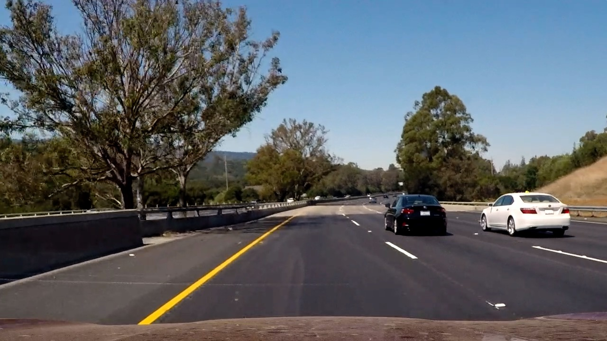
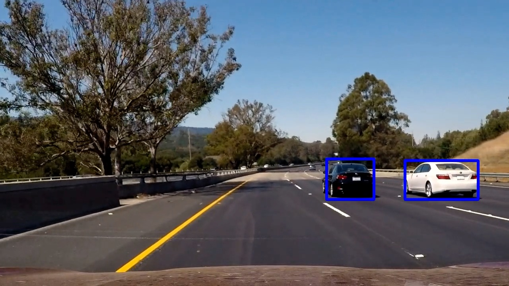
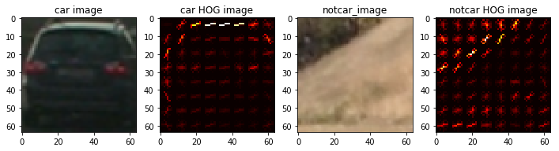
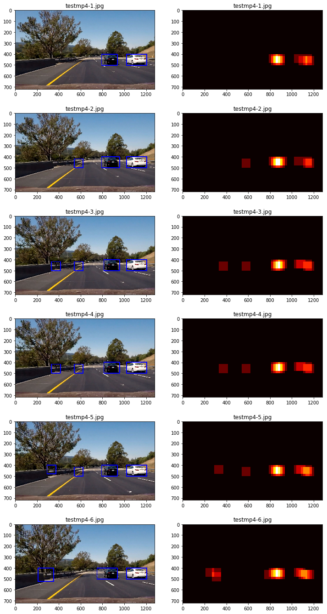

# Project: Vehicle Detection

[](http://www.udacity.com/drive)

## Goal
In this project, your goal is to write a software pipeline to identify vehicles in a video from a front-facing camera on a car. 

| Input                           | Output                            |
| ------------------------------- | --------------------------------- |
|  |  |

## Result
[Output Video](https://youtu.be/HPcA40QtczQ)

## How I Solved
1. Extract Histogram of Oriented Gradients(HOG) features
   
2. Train a Linear SVM classifier
3. Search for vehicles using sliding-window technique
   - Start from the left-middle to right-bottom of the image, slide by 70% of the window
     
4. Create a heat map
   
5. Estimate a bouding box for vehicles
   - Tracking windows: insert and keep the last position of vehicle, the number of detections, etc
   - Delete the false detection: Display windows which appear more than 20 times and delete which is not used recently
   - Make it smooth: Average the last 10 windows' positions
6. Pipeline on a video stream: VideoFileClip

## Terms
1. Support Vector Machines(SVMs)
   - SVM Hyperparameters
   - Cross-validation
2. Color Features
3. Color Spaces
4. Gradient Features
5. Histogram of Oriented Gradients(HOG)

## Skills
Language: Python
Frameworks/Libraries: Jupyter Notebook, Numpy, OpenCV, SciPy, MoviePy, glob, pickle, matplotlib, sklearn, skimage

## How to run
1. Download [GTI vehicle image database](http://www.gti.ssr.upm.es/data/Vehicle_database.html)
2. Download [KITTI vision benchmark suite](http://www.cvlibs.net/datasets/kitti/)
3. Download [repository](https://github.com/OliverPark/CarND-Term1-P5-Vehicle-Detection.git)
   ```Shell
   git clone https://github.com/OliverPark/CarND-Term1-P5-Vehicle-Detection.git
   ```
4. Set your environment and run `vehicle-detection.ipynb` file
   ```Shell
   source activate your_env_name
   jupyter notebook
   ```