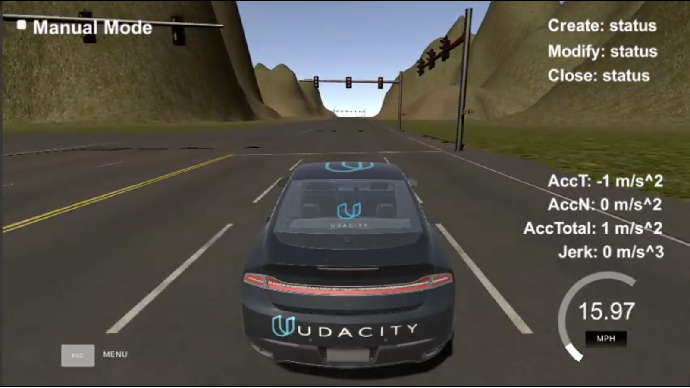

# Project: Programming a Real Self-Driving Car

[](http://www.udacity.com/drive)

## Goal
For this project, you'll be writing ROS nodes to implement core functionality of the autonomous vehicle system, including traffic light detection, control, and waypoint following! You will test your code using a simulator, and when you are ready, your group can submit the project to be run on Carla.



## Result
[Driving on a Simulator](https://www.youtube.com/watch?v=df4rDN-J5kA)

## How I Solved
1. For this project I joined a Team. My team is really diverse and spread all over the world. 
   - Onkar Todakar (Sunnyvale, CA) [@onkartodakar](https://github.com/onkartodakar) Udacity account : [onkartodakar@gmail.com](mailto:onkartodakar@gmail.com)
   - Guangjian Yang (Beijing, China) [@goo00d](https://github.com/goo00d) Udacity account : [y58j32@163.com](mailto:y58j32@163.com)
   - Oliver Park (Seoul, South Korea) [@OliverPark](https://github.com/OliverPark) Udacity account : [chanho16.park@gmail.com](mailto:chanho16.park@gmail.com)
   - Eren Aydemir (Istanbul, Turkey) [@eren-aydemir](https://github.com/eren-aydemir) Udacity account : [eren.aydemir@gmail.com](mailto:eren.aydemir@gmail.com)
   - Hernán Foffani (Madrid, Spain) [@hfoffani](https://github.com/hfoffani) Udacity account : [hfoffani@gmail.com](mailto:hfoffani@gmail.com)
2. System Architecture Diagram
   
3. Implement Traffic Light Classifier(TLC)

   - Using Tensorflow's Object Detection API
   - [Here is my tutorial for TLC](https://github.com/OliverPark/CarND-Traffic-Light-Detection-TF)
   - Training Images
     | Training Image(Simulator)                | Training Image(Real)                     |
     | ---------------------------------------- | ---------------------------------------- |
     |  |  |

4. Implement Traffic Light Detection Node
   - `ros/src/tl_detector/tl_detector.py`

## Terms
1. Robot Operating System (ROS)
   - Message
   - Service
   - Nodes and Topics
   - Publishers nd Subscribers
2. TensorFlow Object Detection API
   - SSD
   - Mobilenet
   - Inception
   - Resnet
   - Faster RCNN

## Skills
Language: Python
Frameworks/Libraries: ROS, TensorFlow Object Detection API

## How to run
1. Clone the project repository
```Shell
git clone https://github.com/OliverPark/CarND-Term3-System-Integration.git
```
2. Install python dependencies
```Shell
cd CarND-Capstone
pip install -r requirements.txt
```
3. Make and run styx
```Shell
cd ros
catkin_make
source devel/setup.sh
roslaunch launch/styx.launch
```
4. Run the simulator
```Shell
source activate your_env_name
jupyter notebook
```