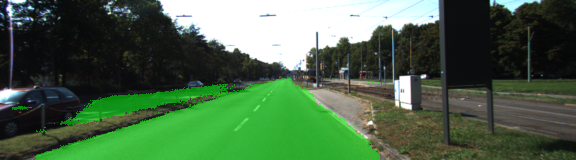
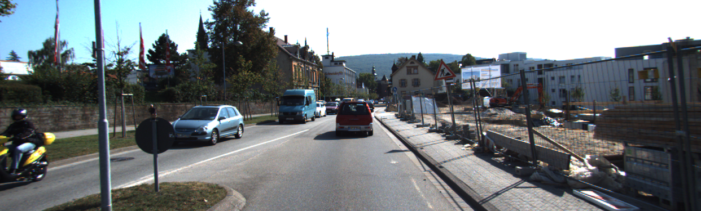
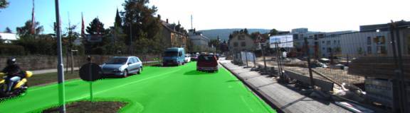
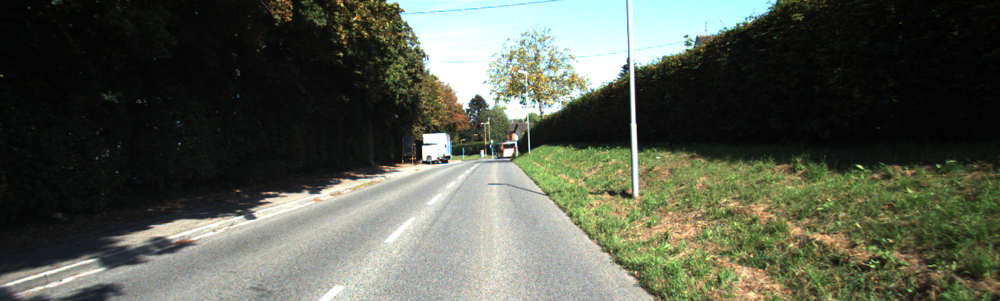
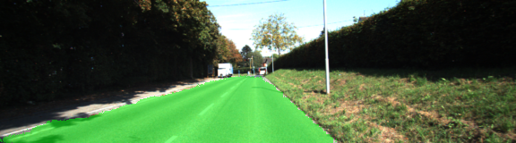
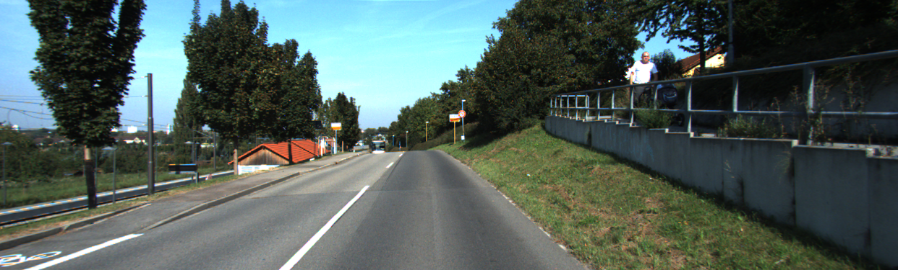
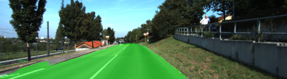
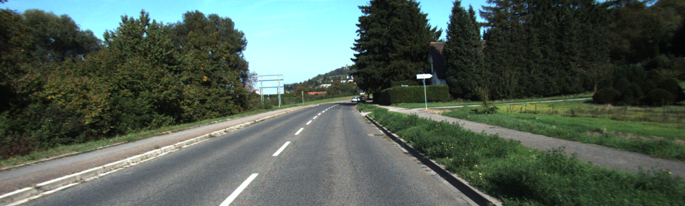
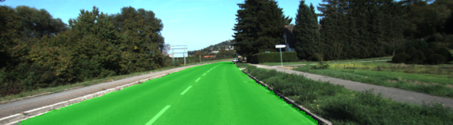

# Project: Semantic Segmentation

[](http://www.udacity.com/drive)

## Goal
In this project, you'll label the pixels of a road in images using a Fully Convolutional Network (FCN).

| Training Image                        | Label Image                     |
| ------------------------------------- | ------------------------------- |
|  |  |

## Result
| Input                            | Output                             |
| -------------------------------- | ---------------------------------- |
|  |  |
|  |  |
|  |  |
|  |  |
|  |  |

## How I Solved
1. Load pretrained VGG model into TensorFlow: **load_vgg()**
2. Create the layers for a fully convolutional network(FCN): **layers()**
3. Build the TensorFlow loss and optimizer operations: **optimize()**
4. Train neural network and print out the loss during training: **train_nn()**

## Terms
1. Fully Convolutional Networks
   - 1x1 Convolution
   - Transposed Convolutions
   - Skip Connections
2. Semantic Segmentation
3. IoU
4. FCN-8
5. Object Detection

## Skills
Language: Python
Frameworks/Libraries: TensorFlow, Numpy, SciPy

## How to run
1. Download [Kitti Road dataset](http://www.cvlibs.net/download.php?file=data_road.zip)
2. Download [repository](https://github.com/OliverPark/CarND-Term3-P2-Semantic-Segmentation.git)
   ```Shell
   git clone https://github.com/OliverPark/CarND-Term3-P2-Semantic-Segmentation.git
   ```
3. Run
   ```Shell
   python main.py
   ```