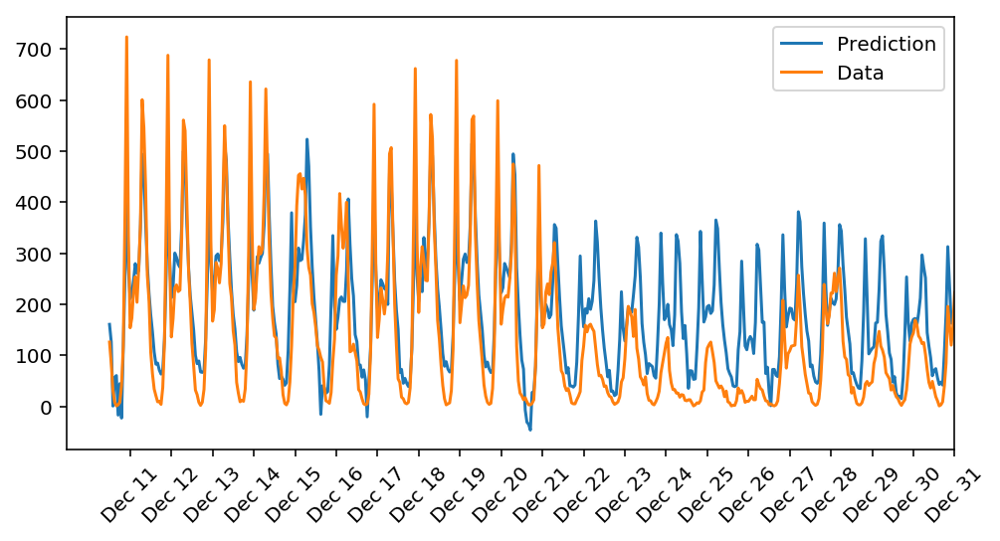

# Project: Your First Neural Network

## Goal
In this project, you'll get to build a neural network from scratch to carry out a prediction problem on a real dataset! By building a neural network from the ground up, you'll have a much better understanding of gradient descent, backpropagation, and other concepts that are important to know before we move to higher level tools such as Tensorflow. You'll also get to see how to apply these networks to solve real prediction problems!

The data comes from the [UCI Machine Learning Database](https://archive.ics.uci.edu/ml/datasets/Bike+Sharing+Dataset).

##### Example

|      | yr   | holiday | temp      | hum      | windspeed | season_1 | season_2 | season_3 | season_4 | weathersit_1 | ...  | hr_21 | hr_22 | hr_23 | weekday_0 | weekday_1 | weekday_2 | weekday_3 | weekday_4 | weekday_5 | weekday_6 |
| ---- | ---- | ------- | --------- | -------- | --------- | -------- | -------- | -------- | -------- | ------------ | ---- | ----- | ----- | ----- | --------- | --------- | --------- | --------- | --------- | --------- | --------- |
| 0    | 0    | 0       | -1.334609 | 0.947345 | -1.553844 | 1        | 0        | 0        | 0        | 1            | ...  | 0     | 0     | 0     | 0         | 0         | 0         | 0         | 0         | 0         | 1         |
| 1    | 0    | 0       | -1.438475 | 0.895513 | -1.553844 | 1        | 0        | 0        | 0        | 1            | ...  | 0     | 0     | 0     | 0         | 0         | 0         | 0         | 0         | 0         | 1         |
| 2    | 0    | 0       | -1.438475 | 0.895513 | -1.553844 | 1        | 0        | 0        | 0        | 1            | ...  | 0     | 0     | 0     | 0         | 0         | 0         | 0         | 0         | 0         | 1         |
| 3    | 0    | 0       | -1.334609 | 0.636351 | -1.553844 | 1        | 0        | 0        | 0        | 1            | ...  | 0     | 0     | 0     | 0         | 0         | 0         | 0         | 0         | 0         | 1         |
| 4    | 0    | 0       | -1.334609 | 0.636351 | -1.553844 | 1        | 0        | 0        | 0        | 1            | ...  | 0     | 0     | 0     | 0         | 0         | 0         | 0         | 0         | 0         | 1         |

## Result


## How I Solved
1. Scaling target variables
2. Splitting the data into training, testing, and validation sets
3. Implement the **sigmoid** function
4. Implement the **forward pass, backpropagation, and the error calculation** in train method
5. Choose the number of epochs, learning rate, hidden nodes

## Terms
1. Linear Regression
2. Numpy
  - Element-wise Matrix Operations
  - Matrix Multiplication
  - Matrix Transposes
3. Logistic Regression
4. Perceptron
5. Gradient Descent
6. Backpropagation

## Skills
Language: Python
Frameworks/Libraries: Jupyter Notebook, NumPy, pandas, matplotlib, 

## How to run
1. Download [Bike Sharing Dataset](https://archive.ics.uci.edu/ml/datasets/Bike+Sharing+Dataset)
2. Download [repository](https://github.com/OliverPark/DLFND-Term1-P1-My-first-neural-network.git)
   ```Shell
   git clone https://github.com/OliverPark/DLFND-Term1-P1-My-first-neural-network.git
   ```
3. Run
   ```Shell
   jupyter notebook
   ```