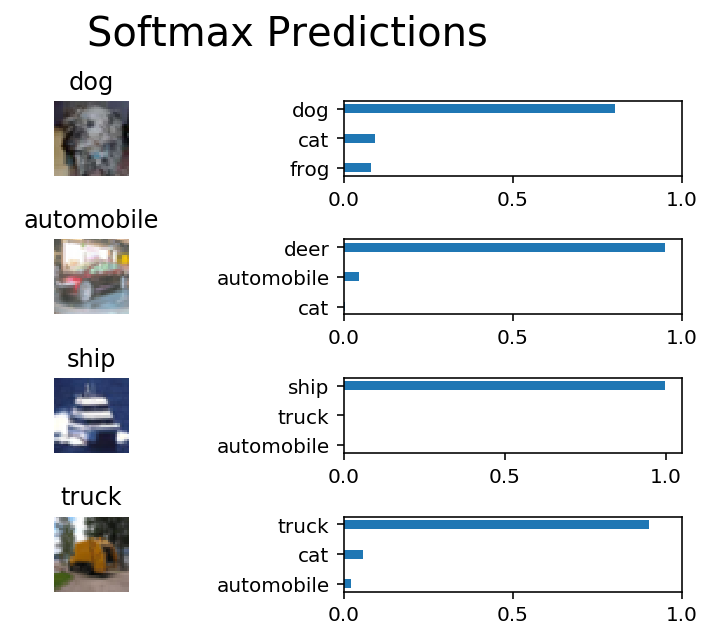

# Project: Image Classification

## Goal
In this project, you'll classify images from the [CIFAR-10 dataset](https://www.cs.toronto.edu/~kriz/cifar.html). The dataset consists of airplanes, dogs, cats, and other objects. The dataset will need to be preprocessed, then train a convolutional neural network on all the samples. You'll normalize the images, one-hot encode the labels, build a convolutional layer, max pool layer, and fully connected layer. At then end, you'll see their predictions on the sample images.

| Input Image                     | Output Label                 |
| ------------------------------- | ---------------------------- |
|  | Label Id: 1 Name: automobile |


## Result
Here are some examples. 

FInal Testing Accuracy: 0.6042993630573248. 

## How I Solved
1. Normalize
2. One-hot encode
3. Randomize Data
4. Implement
  - Convolution and Max Pooling Layer
  - Flatten Layer
  - Fully-connected Layer
5. Tune hyperparameters
  - epochs
  - batch_size
  - keep_probability

## Terms
1. CIFAR-10
2. Normalize
3. One-hot encode
4. Layers
  - Convolution and Max Pooling Layer
  - Flatten Layer
  - Fully-connected Layer
5. Hyperparameters
  - epochs
  - batch_size
  - keep_probability


## Skills
Language: Python
Frameworks/Libraries: Jupyter Notebook, NumPy, sklearn, pickle, TensorFlow

## How to run

1. Create an account on [floydhub.com](https://www.floydhub.com/) (don't forget to confirm your email). You will automatically receive 100 free GPU hours.

2. Install the `floyd` command on your computer:

   ```
    pip install -U floyd-cli

   ```

   Do this even if you already installed `floyd-cli` before, just to make sure you have the most recent version (Its pace of development is fast!).

3. Associate the command with your Floyd account:

   ```
    floyd login

   ```

   (a page with authentication token will open; you will need to copy the token into your terminal)

4. Clone this repository:

   ```
    git clone https://github.com/ludwiktrammer/deep-learning.git

   ```

5. Enter the folder for the image classification project:

   ```
    cd image-classification

   ```

6. Initiate a Floyd project:

   ```
    floyd init dlnd_image_classification

   ```

7. Run the project:

   ```
    floyd run --gpu --env tensorflow --mode jupyter --data diSgciLH4WA7HpcHNasP9j

   ```

   It will be run on a machine with GPU (`--gpu`), using a Tenserflow environment (`--env tensorflow`), as a Jupyter notebook (`--mode jupyter`), with Floyd's built-in cifar-10 dataset available (`--data diSgciLH4WA7HpcHNasP9j`).

8. Wait for the Jupyter notebook to become available and then access the URL displayed in the terminal (described as "path to jupyter notebook"). You will see the notebook.

9. Remember to explicitly stop the experiment when you are not using the notebook. As long as it runs (even in the background) it will cost GPU hours. You can stop an experiment in the ["Experiments" section on floyd.com](https://www.floydhub.com/experiments) or using the `floyd stop` command:

   ```
    floyd stop ID

   ```

   (where ID is the "RUN ID" displayed in the terminal when you run the project; if you lost it you can also find it in the ["Experiments" section on floyd.com](https://www.floydhub.com/experiments))