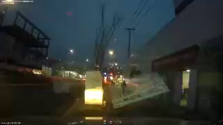

# Mini-Project: Blackbox Video


## Daily Log

#### Jan. 13. 2018
1) 환경세팅
##### Create a conda environment
```
conda create -n mini-project1
```
##### Activate the environment
```
source activate mini-project1
```
##### Install python
```
conda install python
```
##### Install Pylint
```
pip install pylint
```

2) 소리제거

- Sample: [muted_video](muted_video.mp4)

```
$ ffmpeg -i all_videos/20000103_215231_I2.mp4 -an muted_videos/20000103_215231_I2.mp4
ffmpeg version 3.4 Copyright (c) 2000-2017 the FFmpeg developers
  built with Apple LLVM version 9.0.0 (clang-900.0.37)
  configuration: --prefix=/usr/local/Cellar/ffmpeg/3.4 --enable-shared --enable-pthreads --enable-version3 --enable-hardcoded-tables --enable-avresample --cc=clang --host-cflags= --host-ldflags= --enable-gpl --enable-libmp3lame --enable-libx264 --enable-libxvid --enable-opencl --enable-videotoolbox --disable-lzma
  libavutil      55. 78.100 / 55. 78.100
  libavcodec     57.107.100 / 57.107.100
  libavformat    57. 83.100 / 57. 83.100
  libavdevice    57. 10.100 / 57. 10.100
  libavfilter     6.107.100 /  6.107.100
  libavresample   3.  7.  0 /  3.  7.  0
  libswscale      4.  8.100 /  4.  8.100
  libswresample   2.  9.100 /  2.  9.100
  libpostproc    54.  7.100 / 54.  7.100
Input #0, mov,mp4,m4a,3gp,3g2,mj2, from 'all_videos/20000103_215231_I2.mp4':
  Metadata:
    major_brand     : isom
    minor_version   : 1
    compatible_brands: isomavc1
    creation_time   : 2018-01-09T13:44:02.000000Z
  Duration: 00:00:17.02, start: 0.000000, bitrate: 230 kb/s
    Stream #0:0(und): Video: h264 (High) (avc1 / 0x31637661), yuv420p, 320x180 [SAR 1:1 DAR 16:9], 116 kb/s, 20.11 fps, 20.11 tbr, 20113 tbn, 40.23 tbc (default)
    Metadata:
      creation_time   : 2018-01-09T13:44:02.000000Z
      handler_name    : mp4.264#video@GPAC0.5.1-DEV-rev4972
    Stream #0:1(und): Audio: aac (LC) (mp4a / 0x6134706D), 44100 Hz, mono, fltp, 88 kb/s (default)
    Metadata:
      creation_time   : 2018-01-09T13:44:02.000000Z
      handler_name    : mp4.aac#audio@GPAC0.5.1-DEV-rev4972
    Stream #0:2(und): Data: none (rtp  / 0x20707472), 10 kb/s (default)
    Metadata:
      creation_time   : 2018-01-09T13:44:02.000000Z
      handler_name    : GPAC ISO Hint Handler
    Stream #0:3(und): Data: none (rtp  / 0x20707472), 7 kb/s (default)
    Metadata:
      creation_time   : 2018-01-09T13:44:02.000000Z
      handler_name    : GPAC ISO Hint Handler
Stream mapping:
  Stream #0:0 -> #0:0 (h264 (native) -> h264 (libx264))
Press [q] to stop, [?] for help
[libx264 @ 0x7feeaf00f800] using SAR=1/1
[libx264 @ 0x7feeaf00f800] using cpu capabilities: MMX2 SSE2Fast SSSE3 SSE4.2 AVX FMA3 AVX2 LZCNT BMI2
[libx264 @ 0x7feeaf00f800] profile High, level 1.2
[libx264 @ 0x7feeaf00f800] 264 - core 148 r2795 aaa9aa8 - H.264/MPEG-4 AVC codec - Copyleft 2003-2017 - http://www.videolan.org/x264.html - options: cabac=1 ref=3 deblock=1:0:0 analyse=0x3:0x113 me=hex subme=7 psy=1 psy_rd=1.00:0.00 mixed_ref=1 me_range=16 chroma_me=1 trellis=1 8x8dct=1 cqm=0 deadzone=21,11 fast_pskip=1 chroma_qp_offset=-2 threads=6 lookahead_threads=1 sliced_threads=0 nr=0 decimate=1 interlaced=0 bluray_compat=0 constrained_intra=0 bframes=3 b_pyramid=2 b_adapt=1 b_bias=0 direct=1 weightb=1 open_gop=0 weightp=2 keyint=250 keyint_min=20 scenecut=40 intra_refresh=0 rc_lookahead=40 rc=crf mbtree=1 crf=23.0 qcomp=0.60 qpmin=0 qpmax=69 qpstep=4 ip_ratio=1.40 aq=1:1.00
Output #0, mp4, to 'muted_videos/20000103_215231_I2.mp4':
  Metadata:
    major_brand     : isom
    minor_version   : 1
    compatible_brands: isomavc1
    encoder         : Lavf57.83.100
    Stream #0:0(und): Video: h264 (libx264) (avc1 / 0x31637661), yuv420p, 320x180 [SAR 1:1 DAR 16:9], q=-1--1, 20.11 fps, 20113 tbn, 20.11 tbc (default)
    Metadata:
      creation_time   : 2018-01-09T13:44:02.000000Z
      handler_name    : mp4.264#video@GPAC0.5.1-DEV-rev4972
      encoder         : Lavc57.107.100 libx264
    Side data:
      cpb: bitrate max/min/avg: 0/0/0 buffer size: 0 vbv_delay: -1
frame=  344 fps=0.0 q=-1.0 Lsize=     231kB time=00:00:16.95 bitrate= 111.8kbits/s dup=2 drop=0 speed=56.1x    
video:227kB audio:0kB subtitle:0kB other streams:0kB global headers:0kB muxing overhead: 2.115725%
[libx264 @ 0x7feeaf00f800] frame I:2     Avg QP:19.99  size:  5025
[libx264 @ 0x7feeaf00f800] frame P:128   Avg QP:21.75  size:  1444
[libx264 @ 0x7feeaf00f800] frame B:214   Avg QP:28.01  size:   171
[libx264 @ 0x7feeaf00f800] consecutive B-frames:  2.3% 41.9%  7.0% 48.8%
[libx264 @ 0x7feeaf00f800] mb I  I16..4:  2.9% 66.5% 30.6%
[libx264 @ 0x7feeaf00f800] mb P  I16..4:  0.8%  1.4%  0.3%  P16..4: 46.6% 23.4%  9.1%  0.0%  0.0%    skip:18.3%
[libx264 @ 0x7feeaf00f800] mb B  I16..4:  0.0%  0.0%  0.0%  B16..8: 29.3%  2.0%  0.3%  direct: 0.7%  skip:67.7%  L0:32.5% L1:55.0% BI:12.4%
[libx264 @ 0x7feeaf00f800] 8x8 transform intra:60.1% inter:58.2%
[libx264 @ 0x7feeaf00f800] coded y,uvDC,uvAC intra: 61.3% 65.0% 15.2% inter: 12.8% 11.3% 0.3%
[libx264 @ 0x7feeaf00f800] i16 v,h,dc,p: 13% 61% 14% 11%
[libx264 @ 0x7feeaf00f800] i8 v,h,dc,ddl,ddr,vr,hd,vl,hu: 17% 31% 23%  4%  4%  3%  8%  3%  7%
[libx264 @ 0x7feeaf00f800] i4 v,h,dc,ddl,ddr,vr,hd,vl,hu: 30% 32% 11%  3%  4%  3%  7%  3%  6%
[libx264 @ 0x7feeaf00f800] i8c dc,h,v,p: 63% 24% 10%  4%
[libx264 @ 0x7feeaf00f800] Weighted P-Frames: Y:14.1% UV:1.6%
[libx264 @ 0x7feeaf00f800] ref P L0: 73.4% 15.0% 10.0%  1.5%  0.1%
[libx264 @ 0x7feeaf00f800] ref B L0: 91.3%  7.8%  0.9%
[libx264 @ 0x7feeaf00f800] ref B L1: 98.6%  1.4%
[libx264 @ 0x7feeaf00f800] kb/s:108.25
```
3) 동영상을 이미지로 변환
```
$ ffmpeg -i all_videos/20000103_211656_I2.mp4 all_pictures/20000103_211656_I2_%06d.png
ffmpeg version 3.4 Copyright (c) 2000-2017 the FFmpeg developers
  built with Apple LLVM version 9.0.0 (clang-900.0.37)
  configuration: --prefix=/usr/local/Cellar/ffmpeg/3.4 --enable-shared --enable-pthreads --enable-version3 --enable-hardcoded-tables --enable-avresample --cc=clang --host-cflags= --host-ldflags= --enable-gpl --enable-libmp3lame --enable-libx264 --enable-libxvid --enable-opencl --enable-videotoolbox --disable-lzma
  libavutil      55. 78.100 / 55. 78.100
  libavcodec     57.107.100 / 57.107.100
  libavformat    57. 83.100 / 57. 83.100
  libavdevice    57. 10.100 / 57. 10.100
  libavfilter     6.107.100 /  6.107.100
  libavresample   3.  7.  0 /  3.  7.  0
  libswscale      4.  8.100 /  4.  8.100
  libswresample   2.  9.100 /  2.  9.100
  libpostproc    54.  7.100 / 54.  7.100
Input #0, mov,mp4,m4a,3gp,3g2,mj2, from 'all_videos/20000103_211656_I2.mp4':
  Metadata:
    major_brand     : isom
    minor_version   : 1
    compatible_brands: isomavc1
    creation_time   : 2018-01-09T13:26:39.000000Z
  Duration: 00:01:00.02, start: 0.000000, bitrate: 243 kb/s
    Stream #0:0(und): Video: h264 (High) (avc1 / 0x31637661), yuv420p, 320x180 [SAR 1:1 DAR 16:9], 132 kb/s, 20.10 fps, 20.10 tbr, 20097 tbn, 40.19 tbc (default)
    Metadata:
      creation_time   : 2018-01-09T13:26:39.000000Z
      handler_name    : mp4.264#video@GPAC0.5.1-DEV-rev4972
    Stream #0:1(und): Audio: aac (LC) (mp4a / 0x6134706D), 44100 Hz, mono, fltp, 86 kb/s (default)
    Metadata:
      creation_time   : 2018-01-09T13:26:39.000000Z
      handler_name    : mp4.aac#audio@GPAC0.5.1-DEV-rev4972
    Stream #0:2(und): Data: none (rtp  / 0x20707472), 10 kb/s (default)
    Metadata:
      creation_time   : 2018-01-09T13:26:39.000000Z
      handler_name    : GPAC ISO Hint Handler
    Stream #0:3(und): Data: none (rtp  / 0x20707472), 7 kb/s (default)
    Metadata:
      creation_time   : 2018-01-09T13:26:39.000000Z
      handler_name    : GPAC ISO Hint Handler
Stream mapping:
  Stream #0:0 -> #0:0 (h264 (native) -> png (native))
Press [q] to stop, [?] for help
Output #0, image2, to 'all_pictures/20000103_211656_I2_%06d.png':
  Metadata:
    major_brand     : isom
    minor_version   : 1
    compatible_brands: isomavc1
    encoder         : Lavf57.83.100
    Stream #0:0(und): Video: png, rgb24, 320x180 [SAR 1:1 DAR 16:9], q=2-31, 200 kb/s, 20.10 fps, 20.10 tbn, 20.10 tbc (default)
    Metadata:
      creation_time   : 2018-01-09T13:26:39.000000Z
      handler_name    : mp4.264#video@GPAC0.5.1-DEV-rev4972
      encoder         : Lavc57.107.100 png
frame= 1208 fps=1023 q=-0.0 Lsize=N/A time=00:01:00.10 bitrate=N/A dup=2 drop=0 speed=50.9x    
video:100446kB audio:0kB subtitle:0kB other streams:0kB global headers:0kB muxing overhead: unknown
```


4) [Google Python Style Guide](https://google.github.io/styleguide/pyguide.html)
- [Pylint](https://www.pylint.org)
- [Programming is just easier with Pydoc](http://archive.oreilly.com/pub/post/programming_is_just_easier_wit.html)
- [decorator](https://realpython.com/blog/python/primer-on-python-decorators/)
- [What does functools.wraps do?](https://stackoverflow.com/questions/308999/what-does-functools-wraps-do)


#### Jan. 10. 2018

0) 동영상 소리제거, 프레임별 이미지로 변환
1) YOLO를 적용해서 사물을 인식해본다.
2) 윗 단계를 조금 개선해서 차량, 사람, 도로표지, 신호등 등 이미지별로 추출/분류한다. (자동 크롭)
3) 3~4개 세트의 블랙 박스 영상에서 추출된 이미지가 수십만장 정도 될 것으로 예상되므로 CNN을 적용하여 자체적인 모델을 생성한다. 
4) 신호등 인식을 해본다. 
5) (옵션)앞차의 브/레이크등 인식
6) Mask R-CNN 적용
7) (옵션)차선변경 영상 구간 구분하기

#### Jan. 9. 2018
1. Copy dashcam videos
2. convert them from .avi into mp4. 
3. [Sample Video](input_video.mp4)